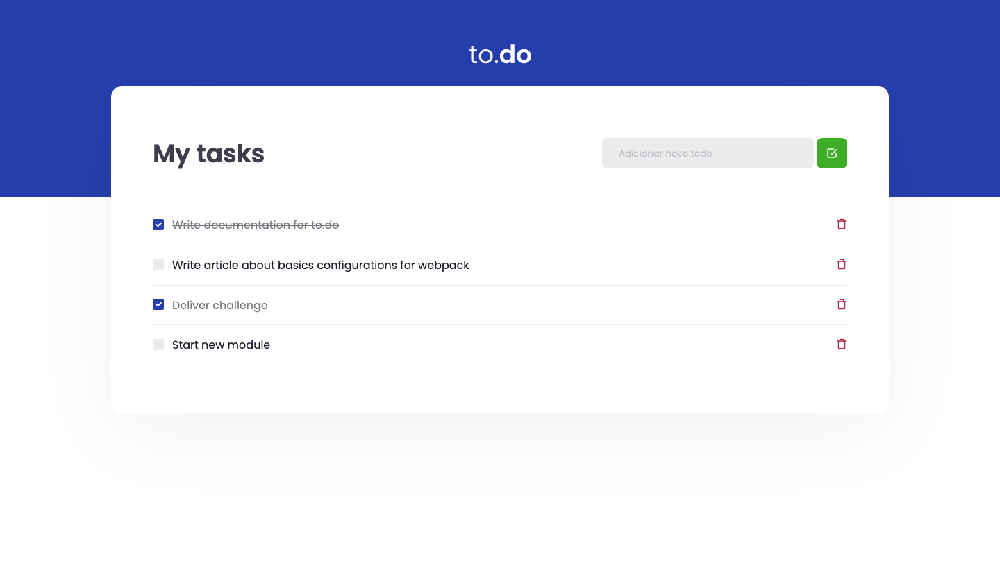

# ignite-todolist-challenge
The challenge is to add the CRUD functionalities. It's a task from the Ignite Bootcamp.

  

	
  
  
  
   
  
  

# 📖 About

This application isthe first challange from the [Ignite Bootcamp](https://rocketseat.com.br/ignite). The objetive is to develop the CRUD functions of this app.

# 📐 Layout

  

    
  

### 🚀 Tecnologies

- React.js
- Typescript
- SCSS
- HTML

# 🔧 How to run

- Download this project to your computer or use the git command `git clone git@github.com:marcoaminotto/ignite-todolist-challenge.git`
- Open the folder ignite-todolist-challenge in your system's shell
- Run `$ yarn install` to install the project's modules

### Webpage

- Open the folder ignite-todolist-challenge in a terminal tab
- Run `$ yarn dev`

# :closed_book: License

Released in 2021 :closed_book: License

This project is under the [MIT license](./LICENSE).

Give a ⭐️ if this project helped you!

#

   <b> &#60;/&#62; by <a href="https://www.linkedin.com/in/marco-echevestre/">Marco Echevestre</a></b>

